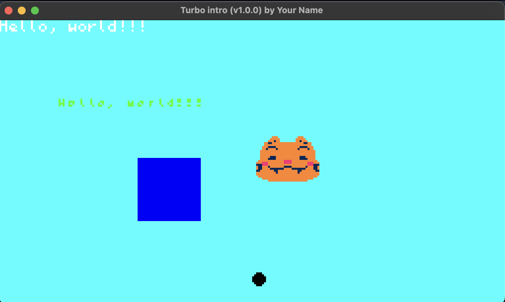

**Start Your Turbo Game Development Adventure with 'Hello, World!' 🚀** (~5-10 mins)


## Installation

### Dependencies   

First, install Rust if it's not already on your system:

<!-- tabs:start -->

#### **macOS / Linux**

```bash
curl --proto '=https' --tlsv1.2 -sSf https://sh.rustup.rs | sh
```

Or follow the instructions at https://www.rust-lang.org/tools/install

#### **Windows**

Follow the **Recommended** instructions using `rustup` at https://www.rust-lang.org/tools/install

!> `turbo-cli` cannot open a window in Windows Subsystem for Linux at the moment due to some quirks of the Wayland display server protocol it uses.

<!-- tabs:end -->

Also, install `cargo-watch` to streamline our workflow:

```bash
cargo install cargo-watch
```


Next, add the necessary WebAssembly targets:

```bash
rustup target add wasm32-unknown-unknown wasm32-wasi
```


### Turbo CLI

Now that our dependencies installed, let's also install `turbo-cli`:

<!-- tabs:start -->

#### **macOS / Linux**

Install `turbo-cli` by running this script:

```bash
sh -c "$(curl -sSfL https://turbo.computer/install.sh)"
```

?> The installer will ask for your password to place the command in `/usr/local/bin`. If you don't want to do this, you can manually download the 64-bit releases and move them to a directory in your `PATH`: [Mac OS ARM](https://turbo.computer/bin/aarch64-apple-darwin/turbo-cli), [Linux x86](https://turbo.computer/bin/x86_64-unknown-linux-gnu/turbo-cli)
<br /><br />
If you need a binary for another platform, contact [Turbo](https://twitter.com/makegamesfast) on Twitter.

Verify the installation with:

```bash
turbo-cli -h
```

If successful, you'll see `turbo-cli`'s help documentation:

```bash
Run Turbo games natively on desktop

Usage: turbo-cli <COMMAND>

Commands:
  init  Initializes a new Turbo project in Rust
  run   Runs a Rust Turbo project
  help  Print this message or the help of the given subcommand(s)

Options:
  -v, --version  Print version
  -h, --help     Print help
  -V, --version  Print version
```

#### **Windows**

1. Download the 64-bit release for [Windows x86](https://turbo.computer/bin/x86_64-pc-windows-msvc/turbo-cli.exe.zip)
2. If it doesn't already exist, create a folder at `C:\Users\YOUR_USERNAME\bin`
3. Unzip the file and move `turbo-cli.exe` into that folder

Make sure you have [Git for Windows](https://git-scm.com/download/win) installed.

**Open Git Bash**. Verify the installation with:

```bash
turbo-cli -h
```

If successful, you'll see `turbo-cli`'s help documentation:

```bash
Run Turbo games natively on desktop

Usage: turbo-cli.exe <COMMAND>

Commands:
  init  Initializes a new Turbo project in Rust
  run   Runs a Rust Turbo project
  help  Print this message or the help of the given subcommand(s)

Options:
  -v, --version  Print version
  -h, --help     Print help
  -V, --version  Print version
```

<!-- tabs:end -->


## Development

?> Windows users should always run `turbo-cli` in Git Bash.

### Creating a Game

Begin by creating a new project called "hello-world":

```
turbo-cli init hello-world
```

This initializes a rust crate in a `hello-world` directory. Open it in your preferred editor.


### Editing a Game

To view your game, run the following command at the root of the project directory:

```
turbo-cli run -w .
```
?> The `-w` flag auto-refreshes your game window as you code. Just be sure to watch the console for compiler errors.


Now, open `src/lib.rs`. You should see something like this:

```rust
// This is where your main game loop code goes
// The stuff in this block will run ~60x per sec
turbo::go! {
  text!("Hello, world!!!");
}
```

Time for your first update. Modify the text and check out your game window:

```rust
text!("Yuuurrr!");
```


Here's a snippet showcasing what's possible with Turbo. Replace the default code in your project's `src/lib.rs` file with the code below. Additionally, in your project folder, create a 'sprite' folder and add the cat image to it:   

```rust
/// This is where your main game loop code goes
// The stuff in this block will run ~60x per sec

// Define the metadata and settings for your Turbo game using the `turbo::cfg!` macro.
turbo::cfg! {
    name = "Turbo intro"
    version = "1.0.0"
    author = "Your Name"
    description = "lfg"
    [settings]
    resolution = [256, 144]
    [solana]
    http-rpc-url = "http://localhost:8899"
    ws-rpc-url = "ws://localhost:8900"
}
/* This `turbo::cfg!` macro serves as a template for defining metadata and settings in your Turbo game. 
Feel free to customize it to match the specifics of your project. */

// Initialize the game state struct.
// The `turbo::init!` block is used to set up the initial state of the game.
// Here, it initializes a struct called GameState with initial values for the x and y positions.
// This block ensures that the game starts with a predefined state before entering the main game loop.
turbo::init! {
    struct GameState {
        x_position: i32,
        y_position: i32,
    } = {
        Self {
            x_position: 30,
            y_position: 40,
        }
    }
}

// This `turbo::go!` macro block is where the main game loop code resides.
turbo::go! {
    // Load the initial game state. 
    // This function ensures that the game starts with a valid initial state.
    let state = GameState::load();
    
    // Set the background color before adding other elements to the game frame.
    clear(0x00ffffff); 
    
    // Display default text with specified position and color.
    text!("yurrr!!!");
    
    // Display customized text with specified position, color, and font size.
    text!("yurrr", x = 30, y = 40, color = 0x00ff00ff, font = Font::S);
    
    // Draw a filled circle at specified position with specified diameter and color.
    circ!(x = 128, y = 128, d = 7, fill = 0x000000ff);
    
    // Draw a filled rectangle at specified position with specified width, height, and color.
    rect!(w = 32, h = 32, x = 70, y = 70, fill = 0x0000ffff);
    
    // Display a sprite named "cat" at specified position with specified frames per second.
    sprite!("cat", x = 30, y = 30, fps = 10);
}


```




## Next Steps

Congratulations on starting your game development journey! 🎉

Ready to level up your skills?

Dive deeper into exciting techniques and Explore the possibilities through interactive demos:

#### [Check out the different game demos Section &rarr;](/examples)

<br />