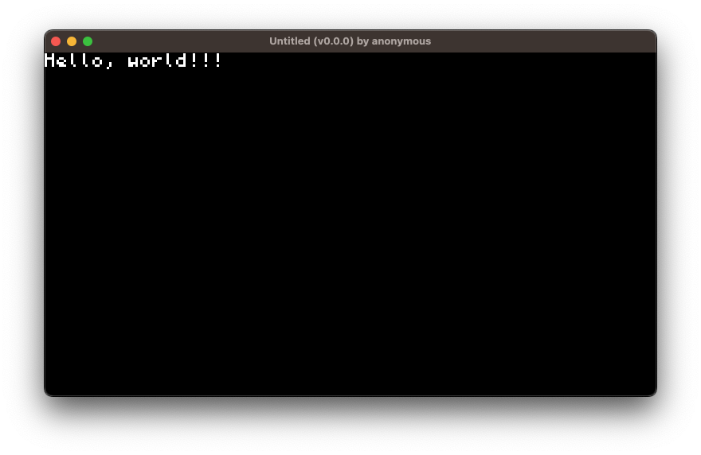
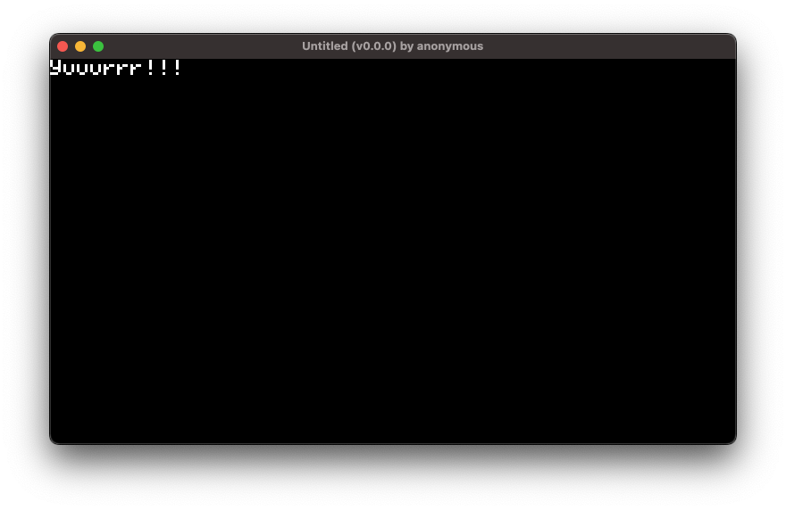

**Start Your Turbo Game Development Adventure with 'Hello, World!' 🚀** (~5-10 mins)


## Installation

### Dependencies

First, install Rust if it's not already on your system:

```bash
curl --proto '=https' --tlsv1.2 -sSf https://sh.rustup.rs | sh
```

Next, add the necessary WebAssembly targets:

```bash
rustup target add wasm32-unknown-unknown wasm32-wasi
```

Also, install `cargo-watch` to streamline our workflow:

```bash
cargo install cargo-watch
```

### Turbo CLI

Now that our dependencies installed, let's also install `turbo-cli`:

```bash
sh -c "$(curl -sSfL https://turbo.computer/install.sh)"
``````

?> The installer may ask for your password to place the command in /usr/local/bin. If you don't want to do this, you can manually download the [Mac OS ARM (64-bit)](https://turbo.computer/bin/aarch64-apple-darwin/turbo-cli) or [Linux x86 (64-bit)](https://turbo.computer/bin/x86_64-unknown-linux-gnu/turbo-cli) builds and move them to that directory. If you need a binary for another platform, contact [Turbo](https://twitter.com/makegamesfast) on Twitter.

Verify the installation with:

```bash
turbo-cli -h
```

If successful, you'll see `turbo-cli`'s help documentation:

```bash
Run Turbo games natively on desktop

Usage: turbo-cli <COMMAND>

Commands:
  init  Initializes a new Turbo project in Rust
  run   Runs a Rust Turbo project
  help  Print this message or the help of the given subcommand(s)

Options:
  -v, --version  Print version
  -h, --help     Print help
  -V, --version  Print version
```

## Development

### Creating a Game

Begin by creating a new project called "hello-world":

```
turbo-cli init hello-world
```

This initializes a rust crate in a `hello-world` directory. Open it in your preferred editor.


### Editing a Game

To view your game, run the following command at the root of the project directory:

```
turbo-cli run -w .
```
?> The `-w` flag auto-refreshes your game window as you code. Just be sure to watch the console for compiler errors.




Now, open `src/lib.rs`. You should see something like this:

```rust
// This is where your main game loop code goes
// The stuff in this block will run ~60x per sec
turbo::go! {
  text!("Hello, world!!!");
}
```

Time for your first update. Modify the text and check out your game window:

```rust
text!("Yuuurrr!");
```




And for the purposes of this guide, that's about all there is to it! If you want to keep playing around, the `text!` macro has several optional parameters you can experiment with:

```rust
text!("Let's gooo!", x = 32, y = 48, color = 0xff00ffff, font = Font::L);
```

## Next Steps

Congratulations on starting your game development journey! 🎉

Ready to level up? To dive deeper, explore drawing shapes, animating sprites, handling gamepad input, game settings, state modeling, and Web3 APIs...

#### [Check out the Tutorials Section &rarr;](/tutorials)

<br />